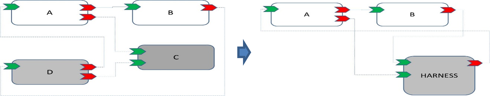

.. Copyright 2023 Dassault Aviation
.. MIT License (see LICENSE.txt)

.. _usage:

*****
Usage
*****

This section aims to show how to use the differents options allowed in the tool. The tool must have been installed before, go see the
:ref:`installation<installation>`.

Principle
#########

The aim of the ASC Test Generator tool is to generate a HARNESS component for testing the components specified in the ASCTG configuration file.
This HARNESS component replace the subset of components not present in the ASCTG configuration file.

Example
#########

Overview
********

* The provider F use the ASCTG configuration file to select A and B.
* The ASCTG tool then remove other components than A and B of the “HARNESS” assembly (associated wires are destroyed but wires between A and B are kept.
* The ASCTG tool create a HARNESS component presenting a “mirroring” service for each service of A and B not connected in the “HARNESS” assembly.
* The ASCTG tool add the new HARNESS component in the “HARNESS” assembly and add wires between each service not connected of A and B, and its mirror service in the HARNESS component.
* The ASCTG tool add a deployment of A, B and HARNESS components

Schema
******

Configuration file
******************

The following configuration file allows the selection of A and B components.

.. code-block:: bash

    <asctg>
      <components>
        <componentInstance>A</componentInstance>
        <componentInstance>B</componentInstance>
      </components>
    </asctg>

Output files
************

The ASCTG tool will create:

* A new component through HARNESS_type.componentType in 2-ComponentDefinitions/HARNESS_type
* A new component implementation HARNESS.impl.xml in 4-ComponentImplementations/HARNESS composed of one module for each connected component, one trigger with a period of 160 ms for each module.

The ASCTG tool will also update:

* xx-harness.deployment.xml: By adding a protection domain HARNESS_PD which is deployed on an existing platform regarding the other protection domains.
* xx-harness.impl.composite: By adding a harness component and new wires.
* xx-harness.project.xml: By adding new files to parse.

Basic run
#########

To run the ASCTG tool:

.. code-block:: bash

    ecoa-asctg -k <checker> -c <path/to/the/ecoa/config/file> -p <path/to/the/ecoa/project/file>

Given paths can be absolute or relative (from the current directory where the user run the tool).

Example
*******

Project PingPong content:
::

  PingPong
  +-- 0-Types
    +-- ECOA.h
    +-- ECOA.hpp
    +-- pingpong.types.xml
  +-- 1-Services
    +-- svc_PingPong.interface.xml
  +-- 2-ComponentDefinitions
    +-- Ping
      +-- Ping.componentType
      +-- Required-svc_Integer.interface.qos.xml
      +-- Required-svc_PingPong.interface.qos.xml
    +-- Pong
      +-- Pong.componentType
      +-- Required-svc_PingPong.interface.qos.xml
  +-- 3-InitialAssembly
      +-- demo.composite
  +-- 4-ComponentImplementations
    +-- Ping
      +-- myDemoPing.impl.xml
    +-- Pong
      +-- myDemoPong.impl.xml
  +-- 5-Integration
    +-- demo.impl.composite
    +-- deployment.xml
    +-- logical_system.xml
  +-- PingPong.config.xml
  +-- PingPong.project.xml

In PingPong.project.xml, a relative path in <outputDirectory> is given : "6-Output".

.. code-block:: bash

    ecoa-asctg -k ecoa-exvt -c PingPong/PingPong.config.xml -p PingPong/PingPong.project.xml

At the end of the command, the tool display the status of the harness generation.
::

    INFO    |=============== OUTPUT DIRECTORY
    INFO    | == Set Output directory
    INFO    |=============== Completed

    INFO    |=============== PARSER CONFIG
    INFO    |Parse from input: PingPong/PingPong.config.xml
    INFO    |Harness components: demoPing
    INFO    |=============== Completed

    INFO    |=============== PARSER
    INFO    |parsing file: PingPong/PingPong.project.xml
    INFO    | == Parse libraries
    INFO    |parsing file: PingPong/0-Types/pingpong.types.xml
    INFO    |Library Name: ECOA 0 18
    INFO    |Library Name: pingpong 1 6
    INFO    | == Parse service definitions
    INFO    |parsing file: PingPong/1-Services/svc_Integer.interface.xml
    INFO    |parsing file: PingPong/1-Services/svc_PingPong.interface.xml
    INFO    | == Parse component types in
    INFO    |parsing file: PingPong/2-ComponentDefinitions/Ping/Ping.componentType
    INFO    |parsing file: PingPong/2-ComponentDefinitions/Pong/Pong.componentType
    INFO    | == Parse component implementations
    INFO    |parsing file: PingPong/4-ComponentImplementations/myDemoPing/myDemoPing.impl.xml
    INFO    |parsing file: PingPong/4-ComponentImplementations/myDemoPong/myDemoPong.impl.xml
    INFO    | == Parse binary descriptions
    INFO    | == Parse Initial Assembly files
    INFO    |parsing file: PingPong/3-InitialAssembly/demo.composite
    INFO    | == Parse Final Assembly composite files
    INFO    |parsing file: PingPong/5-Integration/demo.impl.composite
    INFO    | == Parse logical system
    INFO    |parsing file: PingPong/5-Integration/cs1.logical-system.xml
    INFO    | == Parse deployment files
    INFO    |parsing file: PingPong/5-Integration/demo.deployment.xml
    INFO    | == Check final assembly 'demo'
    INFO    | == Check component-component_type-component_implementation consistency
    INFO    | == Check wire mapping of logical system 'cs1'
    INFO    | == Parse cross platforms view
    INFO    |No cross platforms view
    INFO    | == Parse EUIDs
    INFO    |=============== Completed

    INFO    |=============== BUILD MODEL
    INFO    |[Ping_PD], reduce number of repository by 0
    INFO    |[Pong_PD], reduce number of repository by 0
    INFO    |=============== Completed

    End with :
     - 0 critcal messages
     - 0 error messages
     - 0 warning messages

    INFO    |parsing file: PingPong/PingPong.project.xml
    INFO    |=============== GENERATE HARNESS COMPONENT

    INFO    |Harness for component(s) 'demoPing'
    INFO    |Component type file 'PingPong/2-ComponentDefinitions/HARNESS_type/HARNESS_type.componentType' has been created
    INFO    |Component implementation file 'PingPong/4-ComponentImplementations/HARNESS/HARNESS.impl.xml' has been created
    INFO    |Project config file 'PingPong/PingPong-harness.project.xml' has been updated
    INFO    |Composite File 'PingPong/5-Integration/demo-harness.impl.composite' has been updated
    INFO    |Deployment File 'PingPong/5-Integration/demo-harness.deployment.xml' has been updated
    End with :
     - 0 critcal messages
     - 0 error messages
     - 0 warning messages

Options
#######

Help
****

To display the ECOA version used and the different available options for the tool:

.. code-block:: bash

    ecoa-asctg -h

.. csv-table::
    :name: Help flags
    :header: "Flag", "Description"
    :widths: auto
    :delim: :
    :align: center
    :width: 66%

    "-h, --help":"Displays the optional parameters and the ECOA version of the tool."

Example
=======

Use the command :

.. code-block:: bash

    ecoa-asctg --help

The help option displays the different options and the ECOA version used:

::

    usage: ecoa-asctg [-h] -c CONFIG -p PROJECT -k CHECKER [-o OUTPUT] [-f] [-v {0,1,2,3,4}]

    Generate ECOA modules. this program generate a single ECOA HARNESS component used to test ECOA componnents. ECOA standard version : 6

    optional arguments:
      -h, --help            show this help message and exit
      -c CONFIG, --config CONFIG
                            Path to the Config file
      -p PROJECT, --project PROJECT
                            Path to the ECOA project file
      -k CHECKER, --checker CHECKER
                            Path to the ECOA XML Validation Tool
      -o OUTPUT, --output OUTPUT
                            Path to the output directory (supersedes the project <outputDirectory/> field)
      -f, --force           Overwrite the existing elements
      -v {0,1,2,3,4}, --verbose {0,1,2,3,4}
                            Verbosity level: 0 = Critical, 4 = Debug

Config
***************

The config options is **mandatory** and allows the tool to run a desire xml project.

.. code-block:: bash

    ecoa-asctg -k <checker> -c <path/to/the/ecoa/config/file> -p <path/to/the/ecoa/project/file>

.. csv-table::
    :name: Config flag
    :header: "Flag", "Description"
    :widths: auto
    :delim: :
    :align: center
    :width: 66%

    "-c, --config":"The path to the ECOA config file."

Project
***************

The project option is **mandatory** and allows the tool to run a desire xml project.

.. code-block:: bash

    ecoa-asctg -k <checker> -c <path/to/the/ecoa/config/file> -p <path/to/the/ecoa/project/file>

.. csv-table::
    :name: Project flag
    :header: "Flag", "Description"
    :widths: auto
    :delim: :
    :align: center
    :width: 66%

    "-p, --project":"The path to the ECOA project file."

Checker
*******

The checker option is **mandatory** and is an external tools that verifies if the xml project given in the input project flag is valid.
It returns 0 if the xml files are valid.

.. code-block:: bash

    ecoa-easctg  -k <checker> -c <path/to/the/ecoa/config/file> -p <path/to/the/ecoa/project/file>

.. csv-table::
    :name: Checker flag
    :header: "Flag", "Description"
    :widths: auto
    :delim: :
    :align: center
    :width: 66%

    "-k, --checker":"Check the validity of ECOA XML files."

Example
=======

Project ECOA content:
::

  PingPong
  +-- 0-Types
  +-- 1-Services
  +-- 2-ComponentDefinitions
  +-- 3-InitialAssembly
  +-- 4-ComponentImplementations
  +-- 5-Integration
  +-- PingPong.config.xml
  +-- PingPong.project.xml

In PingPong.project.xml, a relative path in <outputDirectory> is given : "6-Output".

.. code-block:: bash

    ecoa-asctg -k ecoa-exvt -c PingPong/PingPong.config.xml -p PingPong/PingPong.project.xml

At the end of the command, the tool display the status of the harness generation.
::

    INFO    |=============== OUTPUT DIRECTORY
    INFO    | == Set Output directory
    INFO    |=============== Completed

    INFO    |=============== PARSER CONFIG
    INFO    |Parse from input: PingPong/PingPong.config.xml
    INFO    |Harness components: demoPing
    INFO    |=============== Completed

    INFO    |=============== PARSER
    INFO    |parsing file: PingPong/PingPong.project.xml
    INFO    | == Parse libraries
    INFO    |parsing file: PingPong/0-Types/pingpong.types.xml
    INFO    |Library Name: ECOA 0 18
    INFO    |Library Name: pingpong 1 6
    INFO    | == Parse service definitions
    INFO    |parsing file: PingPong/1-Services/svc_Integer.interface.xml
    INFO    |parsing file: PingPong/1-Services/svc_PingPong.interface.xml
    INFO    | == Parse component types in
    INFO    |parsing file: PingPong/2-ComponentDefinitions/Ping/Ping.componentType
    INFO    |parsing file: PingPong/2-ComponentDefinitions/Pong/Pong.componentType
    INFO    | == Parse component implementations
    INFO    |parsing file: PingPong/4-ComponentImplementations/myDemoPing/myDemoPing.impl.xml
    INFO    |parsing file: PingPong/4-ComponentImplementations/myDemoPong/myDemoPong.impl.xml
    INFO    | == Parse binary descriptions
    INFO    | == Parse Initial Assembly files
    INFO    |parsing file: PingPong/3-InitialAssembly/demo.composite
    INFO    | == Parse Final Assembly composite files
    INFO    |parsing file: PingPong/5-Integration/demo.impl.composite
    INFO    | == Parse logical system
    INFO    |parsing file: PingPong/5-Integration/cs1.logical-system.xml
    INFO    | == Parse deployment files
    INFO    |parsing file: PingPong/5-Integration/demo.deployment.xml
    INFO    | == Check final assembly 'demo'
    INFO    | == Check component-component_type-component_implementation consistency
    INFO    | == Check wire mapping of logical system 'cs1'
    INFO    | == Parse cross platforms view
    INFO    |No cross platforms view
    INFO    | == Parse EUIDs
    INFO    |=============== Completed

    INFO    |=============== BUILD MODEL
    INFO    |[Ping_PD], reduce number of repository by 0
    INFO    |[Pong_PD], reduce number of repository by 0
    INFO    |=============== Completed

    End with :
     - 0 critcal messages
     - 0 error messages
     - 0 warning messages

    INFO    |parsing file: PingPong/PingPong.project.xml
    INFO    |=============== GENERATE HARNESS COMPONENT

    INFO    |Harness for component(s) 'demoPing'
    INFO    |Component type file 'PingPong/2-ComponentDefinitions/HARNESS_type/HARNESS_type.componentType' has been created
    INFO    |Component implementation file 'PingPong/4-ComponentImplementations/HARNESS/HARNESS.impl.xml' has been created
    INFO    |Project config file 'PingPong/PingPong-harness.project.xml' has been updated
    INFO    |Composite File 'PingPong/5-Integration/demo-harness.impl.composite' has been updated
    INFO    |Deployment File 'PingPong/5-Integration/demo-harness.deployment.xml' has been updated
    End with :
     - 0 critcal messages
     - 0 error messages
     - 0 warning messages

In the end, the harness files are generated in the ECOA project directories.

::

  PingPong
  +-- 2-ComponentDefinitions/HARNESS_type/HARNESS_type.componentType
  +-- 4-ComponentImplementations/HARNESS/HARNESS.impl.xml
  +-- 5-Integration
    +-- demo-harness.impl.composite
    +-- demo-harness.deployment.xml
  +-- PingPong-harness.project.xml

Output
******

The output option allows to choose where to generate the harness generated files even if the path does not exist.

.. warning::
    An output is mandatory when running the tool. It must be given either in the xml projet with the xml tag <OutputDirectory>
    or with the -o (--output) flag. Be carefull, the -o flag superseeds the xml <OutputDirectory> if the two are given.
    The given path, either it is with the -o output flag or in the xml tag <OutputDirectory>, can be absolute or relative
    (files are generated from where the tool is run).

.. code-block:: bash

    ecoa-easctg  -k <checker> -c <path/to/the/ecoa/config/file> -p <path/to/the/ecoa/project/file> -o <path/where/to/put/generated/files>

.. csv-table::
    :name: Output flags
    :header: "Flag", "Description"
    :widths: auto
    :delim: :
    :align: center
    :width: 66%

    "-o, --output":"Path where the files will be generated."

Example
=======

Project ECOA content:
::

  PingPong
  +-- 0-Types
  +-- 1-Services
  +-- 2-ComponentDefinitions
  +-- 3-InitialAssembly
  +-- 4-ComponentImplementations
  +-- 5-Integration
  +-- PingPong.config.xml
  +-- PingPong.project.xml

In PingPong.project.xml, a relative path in <outputDirectory> is given : "6-Output".

.. code-block:: bash

    ecoa-asctg -k ecoa-exvt -c PingPong/PingPong.config.xml -p PingPong/PingPong.project.xml -o ../PingPong-harness

At the end of the command, the tool display the status of the harness generation.
::

    INFO    |=============== OUTPUT DIRECTORY
    INFO    | == Set Output directory
    INFO    |=============== Completed

    INFO    |=============== PARSER CONFIG
    INFO    |Parse from input: PingPong/PingPong.config.xml
    INFO    |Harness components: demoPing
    INFO    |=============== Completed

    INFO    |=============== PARSER
    INFO    |parsing file: PingPong/PingPong.project.xml
    INFO    | == Parse libraries
    INFO    |parsing file: PingPong/0-Types/pingpong.types.xml
    INFO    |Library Name: ECOA 0 18
    INFO    |Library Name: pingpong 1 6
    INFO    | == Parse service definitions
    INFO    |parsing file: PingPong/1-Services/svc_Integer.interface.xml
    INFO    |parsing file: PingPong/1-Services/svc_PingPong.interface.xml
    INFO    | == Parse component types in
    INFO    |parsing file: PingPong/2-ComponentDefinitions/Ping/Ping.componentType
    INFO    |parsing file: PingPong/2-ComponentDefinitions/Pong/Pong.componentType
    INFO    | == Parse component implementations
    INFO    |parsing file: PingPong/4-ComponentImplementations/myDemoPing/myDemoPing.impl.xml
    INFO    |parsing file: PingPong/4-ComponentImplementations/myDemoPong/myDemoPong.impl.xml
    INFO    | == Parse binary descriptions
    INFO    | == Parse Initial Assembly files
    INFO    |parsing file: PingPong/3-InitialAssembly/demo.composite
    INFO    | == Parse Final Assembly composite files
    INFO    |parsing file: PingPong/5-Integration/demo.impl.composite
    INFO    | == Parse logical system
    INFO    |parsing file: PingPong/5-Integration/cs1.logical-system.xml
    INFO    | == Parse deployment files
    INFO    |parsing file: PingPong/5-Integration/demo.deployment.xml
    INFO    | == Check final assembly 'demo'
    INFO    | == Check component-component_type-component_implementation consistency
    INFO    | == Check wire mapping of logical system 'cs1'
    INFO    | == Parse cross platforms view
    INFO    |No cross platforms view
    INFO    | == Parse EUIDs
    INFO    |=============== Completed

    INFO    |=============== BUILD MODEL
    INFO    |[Ping_PD], reduce number of repository by 0
    INFO    |[Pong_PD], reduce number of repository by 0
    INFO    |=============== Completed

    End with :
     - 0 critcal messages
     - 0 error messages
     - 0 warning messages

    INFO    |parsing file: PingPong/PingPong.project.xml
    INFO    |=============== GENERATE HARNESS COMPONENT

    INFO    |Harness for component(s) 'demoPing'
    INFO    |Component type file 'PingPong/2-ComponentDefinitions/HARNESS_type/HARNESS_type.componentType' has been created
    INFO    |Component implementation file 'PingPong/4-ComponentImplementations/HARNESS/HARNESS.impl.xml' has been created
    INFO    |Project config file 'PingPong/PingPong-harness.project.xml' has been updated
    INFO    |Composite File 'PingPong/5-Integration/demo-harness.impl.composite' has been updated
    INFO    |Deployment File 'PingPong/5-Integration/demo-harness.deployment.xml' has been updated
    End with :
     - 0 critcal messages
     - 0 error messages
     - 0 warning messages

In the end, the harness files are generated in the PingPong-harness directory.

::

  PingPong-harness
  +-- 2-ComponentDefinitions/HARNESS_type/HARNESS_type.componentType
  +-- 4-ComponentImplementations/HARNESS/HARNESS.impl.xml
  +-- 5-Integration
    +-- demo-harness.impl.composite
    +-- demo-harness.deployment.xml
  +-- PingPong-harness.project.xml

Force
*****

The force option allows to overwrite already generated files.

.. code-block:: bash

    ecoa-easctg  -k <checker> -c <path/to/the/ecoa/config/file> -p <path/to/the/ecoa/project/file> -o <path/where/to/put/generated/files> -f

.. csv-table::
    :name: Force flags
    :header: "Flag", "Description"
    :widths: auto
    :delim: :
    :align: center
    :width: 66%

    "-f, --force":"Overwrite the existing elements."

Example
=======

Project ECOA content:
::

  PingPong
  +-- 0-Types
  +-- 1-Services
  +-- 2-ComponentDefinitions
  +-- 3-InitialAssembly
  +-- 4-ComponentImplementations
  +-- 5-Integration
  +-- PingPong.config.xml
  +-- PingPong.project.xml

In PingPong.project.xml, the <outputDirectory> is "Output".

.. code-block:: bash

    ecoa-asctg -k ecoa-exvt -c PingPong/PingPong.config.xml -p PingPong/PingPong.project.xml -f

At the end of the command, the tool display the status of the harness generation and the harness files will be overwritten.
::

    INFO    |=============== OUTPUT DIRECTORY
    INFO    | == Set Output directory
    INFO    |=============== Completed

    INFO    |=============== PARSER CONFIG
    INFO    |Parse from input: PingPong/PingPong.config.xml
    INFO    |Harness components: demoPing
    INFO    |=============== Completed

    INFO    |=============== PARSER
    INFO    |parsing file: PingPong/PingPong.project.xml
    INFO    | == Parse libraries
    INFO    |parsing file: PingPong/0-Types/pingpong.types.xml
    INFO    |Library Name: ECOA 0 18
    INFO    |Library Name: pingpong 1 6
    INFO    | == Parse service definitions
    INFO    |parsing file: PingPong/1-Services/svc_PingPong.interface.xml
    INFO    |parsing file: PingPong/1-Services/svc_Integer.interface.xml
    INFO    | == Parse component types in
    INFO    |parsing file: PingPong/2-ComponentDefinitions/Ping/Ping.componentType
    INFO    |parsing file: PingPong/2-ComponentDefinitions/Pong/Pong.componentType
    INFO    | == Parse component implementations
    INFO    |parsing file: PingPong/4-ComponentImplementations/myDemoPing/myDemoPing.impl.xml
    INFO    |parsing file: PingPong/4-ComponentImplementations/myDemoPong/myDemoPong.impl.xml
    INFO    | == Parse binary descriptions
    INFO    | == Parse Initial Assembly files
    INFO    |parsing file: PingPong/3-InitialAssembly/demo.composite
    INFO    | == Parse Final Assembly composite files
    INFO    |parsing file: PingPong/5-Integration/demo.impl.composite
    INFO    | == Parse logical system
    INFO    |parsing file: PingPong/5-Integration/cs1.logical-system.xml
    INFO    | == Parse deployment files
    INFO    |parsing file: PingPong/5-Integration/demo.deployment.xml
    INFO    | == Check final assembly 'demo'
    INFO    | == Check component-component_type-component_implementation consistency
    INFO    | == Check wire mapping of logical system 'cs1'
    INFO    | == Parse cross platforms view
    INFO    |No cross platforms view
    INFO    | == Parse EUIDs
    INFO    |=============== Completed

    INFO    |=============== BUILD MODEL
    INFO    |[Ping_PD], reduce number of repository by 0
    INFO    |[Pong_PD], reduce number of repository by 0
    INFO    |=============== Completed

    End with :
     - 0 critcal messages
     - 0 error messages
     - 0 warning messages

    INFO    |parsing file: PingPong/PingPong.project.xml
    INFO    |Harness component removed in 'PingPong'
    INFO    |=============== GENERATE HARNESS COMPONENT

    INFO    |Harness for component(s) 'demoPing'
    INFO    |Component type file 'PingPong/2-ComponentDefinitions/HARNESS_type/HARNESS_type.componentType' has been created
    INFO    |Component implementation file 'PingPong/4-ComponentImplementations/HARNESS/HARNESS.impl.xml' has been created
    INFO    |Project config file 'PingPong/PingPong-harness.project.xml' has been updated
    INFO    |Composite File 'PingPong/5-Integration/demo-harness.impl.composite' has been updated
    INFO    |Deployment File 'PingPong/5-Integration/demo-harness.deployment.xml' has been updated
    End with :
     - 0 critcal messages
     - 0 error messages
     - 0 warning messages

In the end, the harness files are overwritten in the ECOA project directories.

::

  PingPong
  +-- 2-ComponentDefinitions/HARNESS_type/HARNESS_type.componentType
  +-- 4-ComponentImplementations/HARNESS/HARNESS.impl.xml
  +-- 5-Integration
    +-- demo-harness.impl.composite
    +-- demo-harness.deployment.xml
  +-- PingPong-harness.project.xml

Verbose
*******

The verbose option displays more detailled information when the tool is running.

.. code-block:: bash

    ecoa-asctg -k <checker> -c <path/to/the/ecoa/config/file> -p <path/to/the/ecoa/project/file> -v <verbose level>

.. csv-table::
    :name: Verbose flags
    :header: "Flag", "Description"
    :widths: auto
    :delim: :
    :align: center
    :width: 66%

    "-v, --verbose":"Displays informations according to the verbose level during ECOA harness generation."

Specific parameters can be combined with -v flag :

.. csv-table::
    :name: Verbose Parameters
    :header: "Parameters", "Description"
    :widths: auto
    :delim: :
    :align: center
    :width: 66%

    "0":"CRITICAL"
    "1":"ERROR"
    "2":"WARNING"
    "3":"INFO"
    "4":"DEBUG"

Example
=======

Project ECOA content:
::

  PingPong
  +-- 0-Types
  +-- 1-Services
  +-- 2-ComponentDefinitions
  +-- 3-InitialAssembly
  +-- 4-ComponentImplementations
  +-- 5-Integration
  +-- PingPong.config.xml
  +-- PingPong.project.xml

When running the tool with the verbose options, the informations are displayed until DEBUG level.

.. code-block:: bash

    ecoa-asctg -k ecoa-exvt -c PingPong/PingPong.config.xml -p PingPong/PingPong.project.xml -v 4

At the end of the command, the tool display the status of the harness generation.

.. code-block:: bash

    INFO    |=============== OUTPUT DIRECTORY
    INFO    | == Set Output directory
    INFO    |=============== Completed

    INFO    |=============== PARSER CONFIG
    INFO    |Parse from input: PingPong/PingPong.config.xml
    INFO    |Harness components: demoPing
    INFO    |=============== Completed

    INFO    |=============== PARSER
    INFO    |parsing file: PingPong/PingPong.project.xml
    INFO    | == Parse libraries
    INFO    |parsing file: PingPong/0-Types/pingpong.types.xml
    INFO    |Library Name: ECOA 0 18
    INFO    |Library Name: pingpong 1 6
    INFO    | == Parse service definitions
    INFO    |parsing file: PingPong/1-Services/svc_Integer.interface.xml
    INFO    |parsing file: PingPong/1-Services/svc_PingPong.interface.xml
    INFO    | == Parse component types in
    INFO    |parsing file: PingPong/2-ComponentDefinitions/Ping/Ping.componentType
    INFO    |parsing file: PingPong/2-ComponentDefinitions/Pong/Pong.componentType
    INFO    | == Parse component implementations
    INFO    |parsing file: PingPong/4-ComponentImplementations/myDemoPing/myDemoPing.impl.xml
    INFO    |parsing file: PingPong/4-ComponentImplementations/myDemoPong/myDemoPong.impl.xml
    INFO    | == Parse binary descriptions
    INFO    | == Parse Initial Assembly files
    INFO    |parsing file: PingPong/3-InitialAssembly/demo.composite
    INFO    | == Parse Final Assembly composite files
    INFO    |parsing file: PingPong/5-Integration/demo.impl.composite
    INFO    | == Parse logical system
    INFO    |parsing file: PingPong/5-Integration/cs1.logical-system.xml
    INFO    | == Parse deployment files
    INFO    |parsing file: PingPong/5-Integration/demo.deployment.xml
    INFO    | == Check final assembly 'demo'
    INFO    | == Check component-component_type-component_implementation consistency
    INFO    | == Check wire mapping of logical system 'cs1'
    INFO    | == Parse cross platforms view
    INFO    |No cross platforms view
    INFO    | == Parse EUIDs
    INFO    |=============== Completed

    INFO    |=============== BUILD MODEL
    INFO    |[Ping_PD], reduce number of repository by 0
    INFO    |[Pong_PD], reduce number of repository by 0
    INFO    |=============== Completed

    End with :
     - 0 critcal messages
     - 0 error messages
     - 0 warning messages

    INFO    |parsing file: PingPong/PingPong.project.xml
    INFO    |=============== GENERATE HARNESS COMPONENT

    INFO    |Harness for component(s) 'demoPing'
    DEBUG   |Wires :[demoPing/svc_PingPong:demoPong/svc_PingPong, demoPing/svc_Integer:demoPong/svc_Integer]
    DEBUG   |Harness old wires :[]
    DEBUG   |Harness new wires :[demoPing/svc_PingPong:HARNESS/demoPing_svc_PingPong, demoPing/svc_Integer:HARNESS/demoPing_svc_Integer]
    INFO    |Component type file 'PingPong/2-ComponentDefinitions/HARNESS_type/HARNESS_type.componentType' has been created
    INFO    |Component implementation file 'PingPong/4-ComponentImplementations/HARNESS/HARNESS.impl.xml' has been created
    INFO    |Project config file 'PingPong/PingPong-harness.project.xml' has been updated
    INFO    |Composite File 'PingPong/5-Integration/demo-harness.impl.composite' has been updated
    DEBUG   |Protection domain 'Ping_PD'
    DEBUG   |Keep Trigger 'demoPing'
    DEBUG   |Keep Module 'demoPing'
    DEBUG   |Protection domain 'Pong_PD'
    DEBUG   |Remove Module 'demoPong'
    DEBUG   |Remove Protection domain 'Pong_PD'
    INFO    |Deployment File 'PingPong/5-Integration/demo-harness.deployment.xml' has been updated
    End with :
     - 0 critcal messages
     - 0 error messages
     - 0 warning messages

