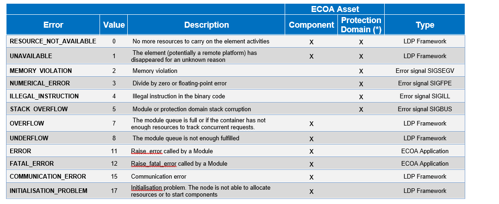

.. Copyright 2023 Dassault Aviation
.. MIT License (see LICENSE.txt)

.. _usage:

*****
Usage
*****

This section aims to show how to use the differents options allowed in the tool. The tool must have been installed before, go see the
:ref:`installation<installation>`.

Principle
#########

The aim of the Lightweight Development Platform Tool is to generate the source code of an ECOA application.
The generated source code is composed of C/C++ files and cmake files.

LDP Mechanism
#############

Fault Handler
*************

Fault Management is performed at various levels within the infrastructure. The aim is to handle faults in such a way as to isolate and minimize fault propagation between Components:

* Error Detection is the general term for detecting an error wherever it is detected
* Fault Handling is the general term for handling a fault wherever it is handled

Fault management involves a pattern made of:

* Detection of errors
* Decision of recovery actions to be performed
* Execution of decided recovery actions.

Table of errors managed by the fault handler
============================================

Here is a table listing all supported errors by the Fault Handler:

(*) Only errors at the Protection Domain level are eligible to recovery action.

Error notification API
======================

Types definition
----------------

The following types used by Error Notification API are defined in ECOA.h file.

.. code-block:: c

    /* ECOA:error_id */
    typedef ECOA__uint32 ECOA__error_id;

    /* ECOA:asset_id */
    typedef ECOA__uint32 ECOA__asset_id;

    /* ECOA:asset_type */
    typedef ECOA__uint32 ECOA__asset_type;
    #define ECOA__asset_type_COMPONENT         (0)
    #define ECOA__asset_type_PROTECTION_DOMAIN (1)

    /* ECOA:error_type */
    typedef ECOA__uint32 ECOA__error_type;
    #define ECOA__error_type_RESOURCE_NOT_AVAILABLE (0)
    #define ECOA__error_type_UNAVAILABLE            (1)
    #define ECOA__error_type_MEMORY_VIOLATION       (2)
    #define ECOA__error_type_NUMERICAL_ERROR        (3)
    #define ECOA__error_type_ILLEGAL_INSTRUCTION    (4)
    #define ECOA__error_type_STACK_OVERFLOW         (5)
    #define ECOA__error_type_DEADLINE_VIOLATION     (6)
    #define ECOA__error_type_OVERFLOW               (7)
    #define ECOA__error_type_UNDERFLOW              (8)
    #define ECOA__error_type_ERROR                  (11)
    #define ECOA__error_type_FATAL_ERROR            (12)
    #define ECOA__error_type_INITIALISATION_PROBLEM (17

Source file
-----------

The error notification source file path is:

.. code-block:: bash

    <app_name>/5-Integration/src/<platform_name>_fault_handler.c

It contains the implementation of the <platform_name>__error_notification function following the prototypes given by ECOA standard ([R-8] § 10.3):

.. code-block:: c

    void <platform_name>__error_notification (
      ldp_fault_handler_context* context,
      ECOA__error_id error_id,
      ECOA__global_time timestamp,
      ECOA__asset_id asset_id,
      ECOA__asset_type asset_type,
      ECOA__error_type error_type,
      ECOA__uint32 error_code)
    {
    /* Implementation */
    }

The implementation of this function provides the way to define the Fault Handler recovery policy dedicated to the application.
The explanation of parameters is provided by ECOA standard ([R-8] § 10.3).

Example
-------

This example of an error notification implementation is extracted from the PingPong application.
In this example “myPlatform” refers to the name of the platform. It should be adapted regarding the name of the platform used in the current application.

.. code-block:: c

    void myPlatform__error_notification (
      ldp_fault_handler_context* context,
      ECOA__error_id error_id,
      ECOA__global_time timestamp,
      ECOA__asset_id asset_id,
      ECOA__asset_type asset_type,
      ECOA__error_type error_type,
      ECOA__uint32 error_code)
    {
        ldp_Main_ctx* ctx=(ldp_Main_ctx*) context->platform_hook;
        ldp_log_PF_log_var(ECOA_LOG_INFO_PF, "INFO", ctx->logger_PF, "[MAIN] Fault Handler NOTIFICATION: [%d:%d] error_id=%d asset_id=%d asset_type=%d error_type=%d error_code=%d", timestamp.seconds, timestamp.nanoseconds,error_id, asset_id, asset_type, error_type, error_code);

        ECOA__log log;
        if (asset_type == ECOA__asset_type_PROTECTION_DOMAIN) {
            if (error_type == ECOA__error_type_RESOURCE_NOT_AVAILABLE) {
                log.current_size = snprintf ((char*)log.data, ECOA__LOG_MAXSIZE, "[MAIN] Fault Handler NOTIFICATION: RESOURCE_NOT_AVAILABLE error received for PD=%d ...", asset_id);
                myPlatform_container__log_info(context, log);
                if (myPlatform_container__recovery_action (context,
                                                           ECOA__recovery_action_type_COLD_RESTART,
                                                           asset_id,
                                                           asset_type) != ECOA__return_status_OK) {
                     log.current_size = snprintf ((char*)log.data, ECOA__LOG_MAXSIZE, "[MAIN] Fault Handler NOTIFICATION: failed to restart PD=%d ...", asset_id);
                     myPlatform_container__log_error(context, log);
                }
            } else if  (error_type == ECOA__error_type_UNAVAILABLE) {
                log.current_size = snprintf ((char*)log.data, ECOA__LOG_MAXSIZE, "[MAIN] Fault Handler NOTIFICATION: UNAVAILABLE error received for PD=%d ...", asset_id);
                myPlatform_container__log_info(context, log);
                if (myPlatform_container__recovery_action (context,
                                                           ECOA__recovery_action_type_SHUTDOWN,
                                                           asset_id,
                                                           asset_type) != ECOA__return_status_OK) {
                     log.current_size = snprintf ((char*)log.data, ECOA__LOG_MAXSIZE, "[MAIN] Fault Handler NOTIFICATION: failed to shutdown PD=%d ...", asset_id);
                     myPlatform_container__log_error(context, log);
                }
            } else {
                log.current_size = snprintf ((char*)log.data, ECOA__LOG_MAXSIZE, "[MAIN] Fault Handler NOTIFICATION: signal error received for PD=%d ...", asset_id);
                myPlatform_container__log_info(context, log);
                if (myPlatform_container__recovery_action (context,
                                                           ECOA__recovery_action_type_COLD_RESTART,
                                                           asset_id,
                                                           asset_type) != ECOA__return_status_OK) {
                     log.current_size = snprintf ((char*)log.data, ECOA__LOG_MAXSIZE, "[MAIN] Fault Handler NOTIFICATION: failed to restart  PD=%d ...", asset_id);
                     myPlatform_container__log_error(context, log);
                }
            }
        }else{
                     log.current_size = snprintf ((char*)log.data, ECOA__LOG_MAXSIZE, "[MAIN] Fault Handler NOTIFICATION: error '%d' received for MOD_ID=%d ...", error_type, asset_id);
                     myPlatform_container__log_info(context, log);
        }
    }

Error_code parameter
--------------------

The error notification API have an additional parameter. This error_code is used to provide the location in the code where the error has occurred.
For each occurrence of an error_type in the code, a value of error_code is provided, so every time an error_type trace is logged, it allows to identify where it is coming from.

As an example, let’s look at the following log:

.. code-block:: bash

    "1627467299,677227060":1:"INFO":"main_PD":"main_node":"[MAIN] Fault Handler NOTIFICATION: [1627467299:677207363] error_id=0 asset_id=2 asset_type=0 error_type=0 error_code=15"

The error_type RESOURCE_NOT_AVAILABLE (id=0) is displayed with an error_code set to 15.
Looking for error_type “RESOURCE_NOT_AVAILABLE” in the generated source code, we found:

.. code-block:: bash

    $ grep -ri ECOA__error_type_RESOURCE_NOT_AVAILABLE app.rootfs

.. code-block:: bash

    app.rootfs/PingPong/0-Types/inc-gen/ECOA.h:#define ECOA__error_type_RESOURCE_NOT_AVAILABLE (0)
    app.rootfs/PingPong/0-Types/inc-gen/ECOA.h:#define ECOA__error_type_RESOURCE_NOT_AVAILABLE (0)
    app.rootfs/PingPong/4-ComponentImplementations/myDemoPing/myDemoPing_AM/src/myDemoPing_AM.c:    ldp_send_fault_error_to_father(demoPing_ctx, getpid(), ECOA__asset_type_PROTECTION_DOMAIN, ECOA__error_type_RESOURCE_NOT_AVAILABLE, 0);
    app.rootfs/PingPong/4-ComponentImplementations/myDemoPing/myDemoPing_AM/src-gen/myDemoPing_AM_container.c:                                    ECOA__error_type_RESOURCE_NOT_AVAILABLE, 15);
    app.rootfs/PingPong/4-ComponentImplementations/myDemoPing/myDemoPing_AM/src-gen/myDemoPing_AM_container.c:                                    ECOA__error_type_RESOURCE_NOT_AVAILABLE, 16);
    app.rootfs/PingPong/4-ComponentImplementations/myDemoPong/myDemoPong_AM/src/myDemoPong_AM.c:    ldp_send_fault_error_to_father(demoPong_ctx, getpid(), ECOA__asset_type_PROTECTION_DOMAIN, ECOA__error_type_RESOURCE_NOT_AVAILABLE, 0);
    app.rootfs/PingPong/4-ComponentImplementations/myDemoPong/myDemoPong_AM/src-gen/myDemoPong_AM_container.c:                                    ECOA__error_type_RESOURCE_NOT_AVAILABLE, 12);
    app.rootfs/PingPong/4-ComponentImplementations/myDemoPong/myDemoPong_AM/src-gen/myDemoPong_AM_container.c:                                    ECOA__error_type_RESOURCE_NOT_AVAILABLE, 13);
    app.rootfs/PingPong/4-ComponentImplementations/myDemoPong/myDemoPong_AM/src-gen/myDemoPong_AM_container.c:                                    ECOA__error_type_RESOURCE_NOT_AVAILABLE, 14);
    app.rootfs/PingPong/5-Integration/src/myPlatform_fault_handler.c:        if (error_type == ECOA__error_type_RESOURCE_NOT_AVAILABLE) {
    app.rootfs/platform/lib/ECOA.h:#define ECOA__error_type_RESOURCE_NOT_AVAILABLE (0)
    app.rootfs/platform/lib/ldp_mod_container_util.c:                                             ECOA__error_type_RESOURCE_NOT_AVAILABLE, 1);
    app.rootfs/platform/lib/ldp_mod_container_util.c:                                         ECOA__error_type_RESOURCE_NOT_AVAILABLE, 2);
    app.rootfs/platform/lib/ldp_mod_container_util.c:                                         ECOA__error_type_RESOURCE_NOT_AVAILABLE, 3);
    app.rootfs/platform/lib/ldp_mod_container_util.c:                                         ECOA__error_type_RESOURCE_NOT_AVAILABLE, 4);
    app.rootfs/platform/lib/ldp_mod_container_util.c:                                             ECOA__error_type_RESOURCE_NOT_AVAILABLE, 5);
    app.rootfs/platform/lib/ldp_mod_container_util.c:                                             ECOA__error_type_RESOURCE_NOT_AVAILABLE, 6);
    app.rootfs/platform/lib/ldp_mod_container_util.c:                                             ECOA__error_type_RESOURCE_NOT_AVAILABLE, 7);
    app.rootfs/platform/lib/ldp_mod_container_util.c:                                             ECOA__error_type_RESOURCE_NOT_AVAILABLE, 8);
    app.rootfs/platform/lib/ldp_mod_container_util.c:                                             ECOA__error_type_RESOURCE_NOT_AVAILABLE, 9);
    app.rootfs/platform/lib/ldp_mod_container_util.c:                                             ECOA__error_type_RESOURCE_NOT_AVAILABLE, 10);
    app.rootfs/platform/lib/ldp_mod_container_util.c:                                             ECOA__error_type_RESOURCE_NOT_AVAILABLE, 11);

error_code ‘15’ is set in file myDemoPing_AM_container.c.
Looking in this source code file, we can then find the function raising the error_type RESOURCE_NOT_AVAILABLE (based on error_code ‘15’).

Raise error and raise fatal error API
=====================================

These API are described by ECOA standard ([SPEC_ECOA_PART4] § 11.3).

It allows to raise error to the fault handler from the application.

Raise_Error
-----------

The following is a prototype definition for the operation:

.. code-block:: c

    void <module_impl_name>_container:raise_error(<context>,const ECOA:log log, ECOA:error_code error_code);

Raise_Fatal_Error
-----------------

The following is a prototype definition for the operation:

.. code-block:: c

    void <module_impl_name>_container:raise_fatal_error(<context>,const ECOA:log log, ECOA:error_code error_code);

The “module_impl_name” is the name of the module’s implementation.
The context is the module’s context.

Multi-nodes
***********

Activating multi-nodes
======================

The activation of multi-nodes is done by specifying different computing nodes for protection domains deployment. This is achieved by modifying the xx.deployment.xml in 5-Integration folder.

**demo.deployment.xml file example:**

.. code-block:: xml

    <deployment finalAssembly="demo" logicalSystem="logical_system"
    xmlns="http://www.ecoa.technology/deployment-2.0">

      <protectionDomain name="Ping_PD">
        <executeOn computingNode="machine0" computingPlatform="myPlatform"/>
        <deployedModuleInstance componentName="demoPing" moduleInstanceName="myDemoPing_AM_I"modulePriority="30"/>
        <deployedTriggerInstance componentName="demoPing" triggerInstanceName="Heart_Beat" triggerPriority="10"/>
      </protectionDomain>

      <protectionDomain name="Pong_PD">
        <executeOn computingNode="machine1" computingPlatform="myPlatform"/>
        <deployedModuleInstance componentName="demoPong" moduleInstanceName="myDemoPong_AM_I" modulePriority="30"/>
      </protectionDomain>

      <platformConfiguration computingPlatform="myPlatform" faultHandlerNotificationMaxNumber="8" />

    </deployment>

The nodes_deployment.xml
========================

When activating the multi-nodes, a nodes_deployment.xml file is required in 5-Integration folder. This file is used to associate the ip addresses with the computing nodes where the protection domains are running on.

The following nodes_deployment.xml file allows to set ip addresses for machine0 and machine1.

.. code-block:: xml

    <nodesDeployment>
        <logicalComputingNode id=”main” ipAddress=”10.0.1.3”/>
        <logicalComputingNode id=”machine0” ipAddress=”10.0.1.4”/>
        <logicalComputingNode id=”machine1” ipAddress=”10.0.1.3”/>
      </components>
    </nodesDeployment>

The multi-node.py file
======================

When activating multi-nodes LDP generate a file named multi-nodes.py, this file is used to launch the ECOA platform in multi-nodes instead launching directly the “platform” binary.

.. code-block:: bash

    $ ./multi-nodes.py

The file multi-nodes.py optionally allows the deployment of binaries and dependencies on the computing nodes before running the ECOA platform (using “–d” switch).

.. code-block:: bash

    $ ./multi-nodes.py –d $ECOA_DEPS_DIR

local.cmake Mechanism
*********************

A module could use an external library by adding a cmake file in the component implementation directory. This cmake file extension is used by the main cmake.

For every component implementation, a static library is created. It is name “lib_#ComponentName#”.

To add an external library to a component implementation, create a file named “local.cmake” in the directory  “4-ComponentImplementation/#ComponentName#”.
Then write the following lines in “local.cmake” file:

    * include_directories(${CMAKE_CURRENT_LIST_DIR}/#relative_lib_path#/include/)
    * target_sources(lib_#ComponentName# PRIVATE ${CMAKE_CURRENT_LIST_DIR}/#relative_lib_path#/src/\*.c)

Basic run
#########

To run the LDP tool:

.. code-block:: bash

    ecoa-ldp -k <checker> -p <path/to/the/ecoa/project/file>

Given paths can be absolute or relative (from the current directory where the user run the tool).

Example
*******

Project PingPong content:
::

  PingPong
  +-- 0-Types
    +-- ECOA.h
    +-- ECOA.hpp
    +-- pingpong.types.xml
  +-- 1-Services
    +-- svc_PingPong.interface.xml
  +-- 2-ComponentDefinitions
    +-- Ping
      +-- Ping.componentType
      +-- Required-svc_Integer.interface.qos.xml
      +-- Required-svc_PingPong.interface.qos.xml
    +-- Pong
      +-- Pong.componentType
      +-- Required-svc_PingPong.interface.qos.xml
  +-- 3-InitialAssembly
      +-- demo.composite
  +-- 4-ComponentImplementations
    +-- Ping
      +-- myDemoPing.impl.xml
    +-- Pong
      +-- myDemoPong.impl.xml
  +-- 5-Integration
    +-- demo.impl.composite
    +-- deployment.xml
    +-- logical_system.xml
  +-- PingPong.project.xml

In PingPong.project.xml, a relative path in <outputDirectory> is given : "6-Output".

.. code-block:: bash

    ecoa-ldp -k ecoa-exvt -p PingPong/PingPong.project.xml

At the end of the command, the tool display the status of the platform generation.
::

    INFO    |=============== OUTPUT DIRECTORY
    INFO    | == Set Output directory
    INFO    |parsing file: PingPong/PingPong.project.xml
    INFO    |=============== Completed

    INFO    |=============== PARSER
    INFO    |parsing file: PingPong/PingPong.project.xml
    INFO    | == Parse libraries
    INFO    |parsing file: PingPong/0-Types/pingpong.types.xml
    INFO    |Library Name: ECOA 0 18
    INFO    |Library Name: pingpong 1 6
    INFO    | == Parse service definitions
    INFO    |parsing file: PingPong/1-Services/svc_Integer.interface.xml
    INFO    |parsing file: PingPong/1-Services/svc_PingPong.interface.xml
    INFO    | == Parse component types in
    INFO    |parsing file: PingPong/2-ComponentDefinitions/Ping/Ping.componentType
    INFO    |parsing file: PingPong/2-ComponentDefinitions/Pong/Pong.componentType
    INFO    | == Parse component implementations
    INFO    |parsing file: PingPong/4-ComponentImplementations/myDemoPing/myDemoPing.impl.xml
    INFO    |parsing file: PingPong/4-ComponentImplementations/myDemoPong/myDemoPong.impl.xml
    INFO    | == Parse binary descriptions
    INFO    | == Parse Initial Assembly files
    INFO    |parsing file: PingPong/3-InitialAssembly/demo.composite
    INFO    | == Parse Final Assembly composite files
    INFO    |parsing file: PingPong/5-Integration/demo.impl.composite
    INFO    | == Parse logical system
    INFO    |parsing file: PingPong/5-Integration/cs1.logical-system.xml
    INFO    | == Parse deployment files
    INFO    |parsing file: PingPong/5-Integration/demo.deployment.xml
    INFO    | == Check final assembly 'demo'
    INFO    | == Check component-component_type-component_implementation consistency
    INFO    | == Check wire mapping of logical system 'cs1'
    INFO    | == Parse cross platforms view
    INFO    |No cross platforms view
    INFO    | == Parse EUIDs
    INFO    |=============== Completed

    INFO    |=============== BUILD MODEL
    INFO    |[Ping_PD], reduce number of repository by 0
    INFO    |[Pong_PD], reduce number of repository by 0
    INFO    |=============== Completed

    End with :
     - 0 critcal messages
     - 0 error messages
     - 0 warning messages

    INFO    |=============== GENERATE platform myPlatform
    INFO    |File info route
    INFO    | == Generate libraries
    INFO    | == Generate all modules
    INFO    | # Generate module implementation in component implementation myDemoPing
    INFO    |    mod: myDemoPing_AM, type: myDemoPing_AM_t, language: C
    INFO    |    Module implementation already exists for myDemoPing_AM
    INFO    | # Generate module implementation in component implementation myDemoPong
    INFO    |    mod: myDemoPong_AM, type: myDemoPong_AM_t, language: C
    INFO    |    Module implementation already exists for myDemoPong_AM
    INFO    | == Generate platform
    INFO    | == Generate all module routers
    INFO    | # Generate component implementation myDemoPing for components ['demoPing']
    INFO    | # Generate component implementation myDemoPong for components ['demoPong']
    INFO    | == Generate protection domains
    INFO    | # Generate C file for PD Ping_PD
    INFO    | # Generate C file for PD Pong_PD
    INFO    |=============== Completed

    INFO    |compare pattern file not found for library ECOA
    INFO    |init pattern file not found for library ECOA
    INFO    |compare pattern file not found for library pingpong
    INFO    |init pattern file not found for library pingpong
    End with :
     - 0 critcal messages
     - 0 error messages
     - 0 warning messages

Options
#######

Help
****

To display the ECOA version used and the different available options for the tool:

.. code-block:: bash

    ecoa-ldp -h

.. csv-table::
    :name: Help flags
    :header: "Flag", "Description"
    :widths: auto
    :delim: :
    :align: center
    :width: 66%

    "-h, --help":"Displays the optional parameters and the ECOA version of the tool."

Example
=======

Use the command :

.. code-block:: bash

    ecoa-ldp --help

The help option displays the different options and the ECOA version used:

::

    usage: ecoa-ldp [-h] -p PROJECT -k CHECKER [-o OUTPUT] [-f] [-g] [-c] [-v {0,1,2,3,4}] [-u {0,1,2,3,4,5,6,7,8,9}]

    Generate ECOA modules. this program generate an LDP ECOA platform described by the project file. ECOA standard version : 6

    optional arguments:
      -h, --help            show this help message and exit
      -p PROJECT, --project PROJECT
                            Path to the ECOA project file
      -k CHECKER, --checker CHECKER
                            Path to the ECOA XML Validation Tool
      -o OUTPUT, --output OUTPUT
                            Path to the output directory (supersedes the project <outputDirectory/> field)
      -f, --force           Overwrite the existing elements
      -g, --debug           Compile with debug informations
      -c, --coverage        Compile with coverage informations
      -v {0,1,2,3,4}, --verbose {0,1,2,3,4}
                            Verbosity level: 0 = Critical, 4 = Debug
      -u {0,1,2,3,4,5,6,7,8,9}, --userid {0,1,2,3,4,5,6,7,8,9}
                            User index for multiple instances

Project
***************

The project option is **mandatory** and allows the tool to run a desire xml project.

.. code-block:: bash

    ecoa-ldp -k <checker> -p <path/to/the/ecoa/project/file>

.. csv-table::
    :name: Project flag
    :header: "Flag", "Description"
    :widths: auto
    :delim: :
    :align: center
    :width: 66%

    "-p, --project":"The path to the ECOA project file."

Checker
*******

The checker option is **mandatory** and is an external tools that verifies if the xml project given in the input project flag is valid.
It returns 0 if the xml files are valid.

.. code-block:: bash

    ecoa-egenplatform  -k <checker> -p <path/to/the/ecoa/project/file>

.. csv-table::
    :name: Checker flag
    :header: "Flag", "Description"
    :widths: auto
    :delim: :
    :align: center
    :width: 66%

    "-k, --checker":"Check the validity of ECOA XML files."

Example
=======

Project ECOA content:
::

  PingPong
  +-- 0-Types
  +-- 1-Services
  +-- 2-ComponentDefinitions
  +-- 3-InitialAssembly
  +-- 4-ComponentImplementations
  +-- 5-Integration
  +-- PingPong.project.xml

In PingPong.project.xml, a relative path in <outputDirectory> is given : "6-Output".

.. code-block:: bash

    ecoa-ldp -k ecoa-exvt -p PingPong/PingPong.project.xml

At the end of the command, the tool display the status of the platform generation.
::

    INFO    |=============== OUTPUT DIRECTORY
    INFO    | == Set Output directory
    INFO    |parsing file: PingPong/PingPong.project.xml
    INFO    |=============== Completed

    INFO    |=============== PARSER
    INFO    |parsing file: PingPong/PingPong.project.xml
    INFO    | == Parse libraries
    INFO    |parsing file: PingPong/0-Types/pingpong.types.xml
    INFO    |Library Name: ECOA 0 18
    INFO    |Library Name: pingpong 1 6
    INFO    | == Parse service definitions
    INFO    |parsing file: PingPong/1-Services/svc_Integer.interface.xml
    INFO    |parsing file: PingPong/1-Services/svc_PingPong.interface.xml
    INFO    | == Parse component types in
    INFO    |parsing file: PingPong/2-ComponentDefinitions/Ping/Ping.componentType
    INFO    |parsing file: PingPong/2-ComponentDefinitions/Pong/Pong.componentType
    INFO    | == Parse component implementations
    INFO    |parsing file: PingPong/4-ComponentImplementations/myDemoPing/myDemoPing.impl.xml
    INFO    |parsing file: PingPong/4-ComponentImplementations/myDemoPong/myDemoPong.impl.xml
    INFO    | == Parse binary descriptions
    INFO    | == Parse Initial Assembly files
    INFO    |parsing file: PingPong/3-InitialAssembly/demo.composite
    INFO    | == Parse Final Assembly composite files
    INFO    |parsing file: PingPong/5-Integration/demo.impl.composite
    INFO    | == Parse logical system
    INFO    |parsing file: PingPong/5-Integration/cs1.logical-system.xml
    INFO    | == Parse deployment files
    INFO    |parsing file: PingPong/5-Integration/demo.deployment.xml
    INFO    | == Check final assembly 'demo'
    INFO    | == Check component-component_type-component_implementation consistency
    INFO    | == Check wire mapping of logical system 'cs1'
    INFO    | == Parse cross platforms view
    INFO    |No cross platforms view
    INFO    | == Parse EUIDs
    INFO    |=============== Completed

    INFO    |=============== BUILD MODEL
    INFO    |[Ping_PD], reduce number of repository by 0
    INFO    |[Pong_PD], reduce number of repository by 0
    INFO    |=============== Completed

    End with :
     - 0 critcal messages
     - 0 error messages
     - 0 warning messages

    INFO    |=============== GENERATE platform myPlatform
    INFO    |File info route
    INFO    | == Generate libraries
    INFO    | == Generate all modules
    INFO    | # Generate module implementation in component implementation myDemoPing
    INFO    |    mod: myDemoPing_AM, type: myDemoPing_AM_t, language: C
    INFO    |    Module implementation already exists for myDemoPing_AM
    INFO    | # Generate module implementation in component implementation myDemoPong
    INFO    |    mod: myDemoPong_AM, type: myDemoPong_AM_t, language: C
    INFO    |    Module implementation already exists for myDemoPong_AM
    INFO    | == Generate platform
    INFO    | == Generate all module routers
    INFO    | # Generate component implementation myDemoPing for components ['demoPing']
    INFO    | # Generate component implementation myDemoPong for components ['demoPong']
    INFO    | == Generate protection domains
    INFO    | # Generate C file for PD Ping_PD
    INFO    | # Generate C file for PD Pong_PD
    INFO    |=============== Completed

    INFO    |compare pattern file not found for library ECOA
    INFO    |init pattern file not found for library ECOA
    INFO    |compare pattern file not found for library pingpong
    INFO    |init pattern file not found for library pingpong
    End with :
     - 0 critcal messages
     - 0 error messages
     - 0 warning messages

In the end, the platform files are generated in the ECOA project directories.

::

  PingPong
  +-- 0-Types
    +-- inc
    +-- inc-gen
    +-- src-gen
    +-- test
  +-- 4-ComponentImplementations/myDemoPing/myDemoPing_AM
    +-- inc-gen
    +-- src-gen
    +-- test
  +-- 4-ComponentImplementations/myDemoPong/myDemoPong_AM
    +-- inc-gen
    +-- src-gen
    +-- test
  +-- 5-Integration
    +-- inc
    +-- inc-gen
    +-- src-gen
    +-- PingPong.ids.xml
  +-- 6-Output

Debug
*****

The debug option indicates to compilation with debug informations.

.. code-block:: bash

    ecoa-egenplatform  -k <checker> -p <path/to/the/ecoa/project/file>

.. csv-table::
    :name: Debug flag
    :header: "Flag", "Description"
    :widths: auto
    :delim: :
    :align: center
    :width: 66%

    "-d, --debug":"Compile with debug informations"

Coverage
********

The debug option indicates to compilation with coverage informations.

.. code-block:: bash

    ecoa-egenplatform  -k <checker> -p <path/to/the/ecoa/project/file>

.. csv-table::
    :name: Coverage flag
    :header: "Flag", "Description"
    :widths: auto
    :delim: :
    :align: center
    :width: 66%

    "-c, --coverage":"Compile with coverage informations"

Output
******

The output option allows to choose where to generate the platform files even if the path does not exist.

.. warning::
    An output is mandatory when running the tool. It must be given either in the xml projet with the xml tag <OutputDirectory>
    or with the -o (--output) flag. Be carefull, the -o flag superseeds the xml <OutputDirectory> if the two are given.
    The given path, either it is with the -o output flag or in the xml tag <OutputDirectory>, can be absolute or relative
    (files are generated from where the tool is run).

.. code-block:: bash

    ecoa-egenplatform  -k <checker> -p <path/to/the/ecoa/project/file> -o <path/where/to/put/generated/files>

.. csv-table::
    :name: Output flags
    :header: "Flag", "Description"
    :widths: auto
    :delim: :
    :align: center
    :width: 66%

    "-o, --output":"Path where the files will be generated."

Example
=======

Project ECOA content:
::

  PingPong
  +-- 0-Types
  +-- 1-Services
  +-- 2-ComponentDefinitions
  +-- 3-InitialAssembly
  +-- 4-ComponentImplementations
  +-- 5-Integration
  +-- PingPong.project.xml

In PingPong.project.xml, a relative path in <outputDirectory> is given : "6-Output".

.. code-block:: bash

    ecoa-ldp -k ecoa-exvt -p PingPong/PingPong.project.xml -o ../PingPong-output

At the end of the command, the tool display the status of the platform generation.
::

    INFO    |=============== OUTPUT DIRECTORY
    INFO    | == Set Output directory
    INFO    |parsing file: PingPong/PingPong.project.xml
    INFO    |=============== Completed

    INFO    |=============== PARSER
    INFO    |parsing file: PingPong/PingPong.project.xml
    INFO    | == Parse libraries
    INFO    |parsing file: PingPong/0-Types/pingpong.types.xml
    INFO    |Library Name: ECOA 0 18
    INFO    |Library Name: pingpong 1 6
    INFO    | == Parse service definitions
    INFO    |parsing file: PingPong/1-Services/svc_PingPong.interface.xml
    INFO    |parsing file: PingPong/1-Services/svc_Integer.interface.xml
    INFO    | == Parse component types in
    INFO    |parsing file: PingPong/2-ComponentDefinitions/Ping/Ping.componentType
    INFO    |parsing file: PingPong/2-ComponentDefinitions/Pong/Pong.componentType
    INFO    | == Parse component implementations
    INFO    |parsing file: PingPong/4-ComponentImplementations/myDemoPing/myDemoPing.impl.xml
    INFO    |parsing file: PingPong/4-ComponentImplementations/myDemoPong/myDemoPong.impl.xml
    INFO    | == Parse binary descriptions
    INFO    | == Parse Initial Assembly files
    INFO    |parsing file: PingPong/3-InitialAssembly/demo.composite
    INFO    | == Parse Final Assembly composite files
    INFO    |parsing file: PingPong/5-Integration/demo.impl.composite
    INFO    | == Parse logical system
    INFO    |parsing file: PingPong/5-Integration/cs1.logical-system.xml
    INFO    | == Parse deployment files
    INFO    |parsing file: PingPong/5-Integration/demo.deployment.xml
    INFO    | == Check final assembly 'demo'
    INFO    | == Check component-component_type-component_implementation consistency
    INFO    | == Check wire mapping of logical system 'cs1'
    INFO    | == Parse cross platforms view
    INFO    |No cross platforms view
    INFO    | == Parse EUIDs
    INFO    |=============== Completed

    INFO    |=============== BUILD MODEL
    INFO    |[Ping_PD], reduce number of repository by 0
    INFO    |[Pong_PD], reduce number of repository by 0
    INFO    |=============== Completed

    End with :
     - 0 critcal messages
     - 0 error messages
     - 0 warning messages

    INFO    |=============== GENERATE platform myPlatform
    INFO    |File info route
    INFO    | == Generate libraries
    INFO    | == Generate all modules
    INFO    | # Generate module implementation in component implementation myDemoPing
    INFO    |    mod: myDemoPing_AM, type: myDemoPing_AM_t, language: C
    INFO    |    Module implementation already exists for myDemoPing_AM
    INFO    | # Generate module implementation in component implementation myDemoPong
    INFO    |    mod: myDemoPong_AM, type: myDemoPong_AM_t, language: C
    INFO    |    Module implementation already exists for myDemoPong_AM
    INFO    | == Generate platform
    INFO    | == Generate all module routers
    INFO    | # Generate component implementation myDemoPing for components ['demoPing']
    INFO    | # Generate component implementation myDemoPong for components ['demoPong']
    INFO    | == Generate protection domains
    INFO    | # Generate C file for PD Ping_PD
    INFO    | # Generate C file for PD Pong_PD
    INFO    |=============== Completed

    INFO    |compare pattern file not found for library ECOA
    INFO    |init pattern file not found for library ECOA
    INFO    |compare pattern file not found for library pingpong
    INFO    |init pattern file not found for library pingpong
    End with :
     - 0 critcal messages
     - 0 error messages
     - 0 warning messages

In the end, the platform files are generated in the PingPong-output directory.

::

  PingPong
  +-- 0-Types
    +-- inc
    +-- inc-gen
    +-- src-gen
    +-- test
  +-- 4-ComponentImplementations/myDemoPing/myDemoPing_AM
    +-- inc-gen
    +-- src-gen
    +-- test
  +-- 4-ComponentImplementations/myDemoPong/myDemoPong_AM
    +-- inc-gen
    +-- src-gen
    +-- test
  +-- 5-Integration
    +-- inc
    +-- inc-gen
    +-- src-gen
    +-- PingPong.ids.xml
  PingPong-Output

Force
*****

The force option allows to overwrite already generated files.

.. code-block:: bash

    ecoa-egenplatform  -k <checker> -p <path/to/the/ecoa/project/file> -f

.. csv-table::
    :name: Force flags
    :header: "Flag", "Description"
    :widths: auto
    :delim: :
    :align: center
    :width: 66%

    "-f, --force":"Overwrite the existing elements."

Example
=======

Project ECOA content:
::

  PingPong
  +-- 0-Types
  +-- 1-Services
  +-- 2-ComponentDefinitions
  +-- 3-InitialAssembly
  +-- 4-ComponentImplementations
  +-- 5-Integration
  +-- PingPong.project.xml

In PingPong.project.xml, the <outputDirectory> is "Output".

.. code-block:: bash

    ecoa-ldp -k ecoa-exvt -p PingPong/PingPong.project.xml -f

At the end of the command, the tool display the status of the platform generation and the platform files will be overwritten.
::

    INFO    |=============== OUTPUT DIRECTORY
    INFO    | == Set Output directory
    INFO    |parsing file: PingPong/PingPong.project.xml
    INFO    |=============== Completed

    INFO    |=============== PARSER
    INFO    |parsing file: PingPong/PingPong.project.xml
    INFO    | == Parse libraries
    INFO    |parsing file: PingPong/0-Types/pingpong.types.xml
    INFO    |Library Name: ECOA 0 18
    INFO    |Library Name: pingpong 1 6
    INFO    | == Parse service definitions
    INFO    |parsing file: PingPong/1-Services/svc_PingPong.interface.xml
    INFO    |parsing file: PingPong/1-Services/svc_Integer.interface.xml
    INFO    | == Parse component types in
    INFO    |parsing file: PingPong/2-ComponentDefinitions/Ping/Ping.componentType
    INFO    |parsing file: PingPong/2-ComponentDefinitions/Pong/Pong.componentType
    INFO    | == Parse component implementations
    INFO    |parsing file: PingPong/4-ComponentImplementations/myDemoPing/myDemoPing.impl.xml
    INFO    |parsing file: PingPong/4-ComponentImplementations/myDemoPong/myDemoPong.impl.xml
    INFO    | == Parse binary descriptions
    INFO    | == Parse Initial Assembly files
    INFO    |parsing file: PingPong/3-InitialAssembly/demo.composite
    INFO    | == Parse Final Assembly composite files
    INFO    |parsing file: PingPong/5-Integration/demo.impl.composite
    INFO    | == Parse logical system
    INFO    |parsing file: PingPong/5-Integration/cs1.logical-system.xml
    INFO    | == Parse deployment files
    INFO    |parsing file: PingPong/5-Integration/demo.deployment.xml
    INFO    | == Check final assembly 'demo'
    INFO    | == Check component-component_type-component_implementation consistency
    INFO    | == Check wire mapping of logical system 'cs1'
    INFO    | == Parse cross platforms view
    INFO    |No cross platforms view
    INFO    | == Parse EUIDs
    INFO    |=============== Completed

    INFO    |=============== BUILD MODEL
    INFO    |[Ping_PD], reduce number of repository by 0
    INFO    |[Pong_PD], reduce number of repository by 0
    INFO    |=============== Completed

    End with :
     - 0 critcal messages
     - 0 error messages
     - 0 warning messages

    INFO    |=============== GENERATE platform myPlatform
    INFO    |File info route
    INFO    | == Generate libraries
    ERROR   |    Erase existing implementation (/home/dev3/tdc/Work/Increment4/TDCIL-344/PingPong/0-Types/inc/pingpong.h)
    ERROR   |    Erase existing implementation (/home/dev3/tdc/Work/Increment4/TDCIL-344/PingPong/0-Types/inc-gen/pingpong_serialization.h)
    ERROR   |    Erase existing implementation (/home/dev3/tdc/Work/Increment4/TDCIL-344/PingPong/0-Types/src-gen/pingpong_serialization.c)
    ERROR   |    Erase existing implementation (/home/dev3/tdc/Work/Increment4/TDCIL-344/PingPong/0-Types/test/serialization_test.mak)
    ERROR   |    Erase existing implementation (/home/dev3/tdc/Work/Increment4/TDCIL-344/PingPong/0-Types/test/serialization_test.c)
    ERROR   |    Erase existing implementation (/home/dev3/tdc/Work/Increment4/TDCIL-344/PingPong/0-Types/test/serialization_test.cpp)
    ERROR   |    Erase existing implementation (/home/dev3/tdc/Work/Increment4/TDCIL-344/PingPong/0-Types/inc/pingpong.hpp)
    INFO    | == Generate all modules
    INFO    | # Generate module implementation in component implementation myDemoPing
    INFO    |    mod: myDemoPing_AM, type: myDemoPing_AM_t, language: C
    INFO    |    Module implementation already exists for myDemoPing_AM
    INFO    |    Erase existing module implementation
    ERROR   |    Erase existing implementation (/home/dev3/tdc/Work/Increment4/TDCIL-344/PingPong/4-ComponentImplementations/myDemoPing/myDemoPing_AM/src/myDemoPing_AM.c)
    ERROR   |    Erase existing implementation (/home/dev3/tdc/Work/Increment4/TDCIL-344/PingPong/4-ComponentImplementations/myDemoPing/myDemoPing_AM/inc/myDemoPing_AM_user_context.h)
    INFO    | # Generate module implementation in component implementation myDemoPong
    INFO    |    mod: myDemoPong_AM, type: myDemoPong_AM_t, language: C
    INFO    |    Module implementation already exists for myDemoPong_AM
    INFO    |    Erase existing module implementation
    ERROR   |    Erase existing implementation (/home/dev3/tdc/Work/Increment4/TDCIL-344/PingPong/4-ComponentImplementations/myDemoPong/myDemoPong_AM/src/myDemoPong_AM.c)
    ERROR   |    Erase existing implementation (/home/dev3/tdc/Work/Increment4/TDCIL-344/PingPong/4-ComponentImplementations/myDemoPong/myDemoPong_AM/inc/myDemoPong_AM_user_context.h)
    INFO    | == Generate platform
    ERROR   |    Erase existing implementation (/home/dev3/tdc/Work/Increment4/TDCIL-344/PingPong/6-Output/platform/main.c)
    ERROR   |    Erase existing implementation (/home/dev3/tdc/Work/Increment4/TDCIL-344/PingPong/6-Output/platform/main_tools.h)
    ERROR   |    Erase existing implementation (/home/dev3/tdc/Work/Increment4/TDCIL-344/PingPong/5-Integration/src-gen/myPlatform_container.c)
    ERROR   |    Erase existing implementation (/home/dev3/tdc/Work/Increment4/TDCIL-344/PingPong/5-Integration/inc-gen/myPlatform_container.h)
    ERROR   |    Erase existing implementation (/home/dev3/tdc/Work/Increment4/TDCIL-344/PingPong/5-Integration/src/myPlatform_fault_handler.c)
    ERROR   |    Erase existing implementation (/home/dev3/tdc/Work/Increment4/TDCIL-344/PingPong/5-Integration/inc/myPlatform_fault_handler.h)
    ERROR   |    Erase existing implementation (/home/dev3/tdc/Work/Increment4/TDCIL-344/PingPong/5-Integration/inc/myPlatform_user_context.h)
    ERROR   |    Erase existing implementation (/home/dev3/tdc/Work/Increment4/TDCIL-344/PingPong/6-Output/platform/../CMakeLists.txt)
    ERROR   |    Erase existing implementation (/home/dev3/tdc/Work/Increment4/TDCIL-344/PingPong/6-Output/platform/CMakeLists.txt)
    ERROR   |    Erase existing implementation (/home/dev3/tdc/Work/Increment4/TDCIL-344/PingPong/6-Output/platform/log_properties/log_Ping_PD.properties)
    ERROR   |    Erase existing implementation (/home/dev3/tdc/Work/Increment4/TDCIL-344/PingPong/6-Output/platform/log_properties/log_Ping_PD_PF.properties)
    ERROR   |    Erase existing implementation (/home/dev3/tdc/Work/Increment4/TDCIL-344/PingPong/6-Output/platform/log_properties/log_Pong_PD.properties)
    ERROR   |    Erase existing implementation (/home/dev3/tdc/Work/Increment4/TDCIL-344/PingPong/6-Output/platform/log_properties/log_Pong_PD_PF.properties)
    ERROR   |    Erase existing implementation (/home/dev3/tdc/Work/Increment4/TDCIL-344/PingPong/6-Output/platform/log_properties/log_main_PF.properties)
    ERROR   |    Erase existing implementation (/home/dev3/tdc/Work/Increment4/TDCIL-344/PingPong/6-Output/platform/route.h)
    INFO    | == Generate all module routers
    INFO    | # Generate component implementation myDemoPing for components ['demoPing']
    ERROR   |    Erase existing implementation (/home/dev3/tdc/Work/Increment4/TDCIL-344/PingPong/6-Output/myDemoPing/component_myDemoPing.h)
    ERROR   |    Erase existing implementation (/home/dev3/tdc/Work/Increment4/TDCIL-344/PingPong/6-Output/myDemoPing/component_myDemoPing.c)
    ERROR   |    Erase existing implementation (/home/dev3/tdc/Work/Increment4/TDCIL-344/PingPong/6-Output/myDemoPing/CMakeLists.txt)
    ERROR   |    Erase existing implementation (/home/dev3/tdc/Work/Increment4/TDCIL-344/PingPong/6-Output/myDemoPing/component_myDemoPing__properties.h)
    INFO    | # Generate component implementation myDemoPong for components ['demoPong']
    ERROR   |    Erase existing implementation (/home/dev3/tdc/Work/Increment4/TDCIL-344/PingPong/6-Output/myDemoPong/component_myDemoPong.h)
    ERROR   |    Erase existing implementation (/home/dev3/tdc/Work/Increment4/TDCIL-344/PingPong/6-Output/myDemoPong/component_myDemoPong.c)
    ERROR   |    Erase existing implementation (/home/dev3/tdc/Work/Increment4/TDCIL-344/PingPong/6-Output/myDemoPong/CMakeLists.txt)
    ERROR   |    Erase existing implementation (/home/dev3/tdc/Work/Increment4/TDCIL-344/PingPong/6-Output/myDemoPong/component_myDemoPong__properties.h)
    INFO    | == Generate protection domains
    INFO    | # Generate C file for PD Ping_PD
    ERROR   |    Erase existing implementation (/home/dev3/tdc/Work/Increment4/TDCIL-344/PingPong/6-Output/platform/PD_Ping_PD.c)
    INFO    | # Generate C file for PD Pong_PD
    ERROR   |    Erase existing implementation (/home/dev3/tdc/Work/Increment4/TDCIL-344/PingPong/6-Output/platform/PD_Pong_PD.c)
    INFO    |=============== Completed

    INFO    |compare pattern file not found for library ECOA
    INFO    |init pattern file not found for library ECOA
    INFO    |compare pattern file not found for library pingpong
    INFO    |init pattern file not found for library pingpong
    ERROR   |    Erase existing implementation (/home/dev3/tdc/Work/Increment4/TDCIL-344/PingPong/0-Types/inc-gen/DAV__ECOA_types_compare.h)
    ERROR   |    Erase existing implementation (/home/dev3/tdc/Work/Increment4/TDCIL-344/PingPong/0-Types/src-gen/DAV__ECOA_types_compare.c)
    ERROR   |    Erase existing implementation (/home/dev3/tdc/Work/Increment4/TDCIL-344/PingPong/0-Types/inc-gen/DAV__pingpong_types_compare.h)
    ERROR   |    Erase existing implementation (/home/dev3/tdc/Work/Increment4/TDCIL-344/PingPong/0-Types/src-gen/DAV__pingpong_types_compare.c)
    ERROR   |    Erase existing implementation (/home/dev3/tdc/Work/Increment4/TDCIL-344/PingPong/0-Types/inc-gen/DAV__ECOA_types_zeroise.h)
    ERROR   |    Erase existing implementation (/home/dev3/tdc/Work/Increment4/TDCIL-344/PingPong/0-Types/src-gen/DAV__ECOA_types_zeroise.c)
    ERROR   |    Erase existing implementation (/home/dev3/tdc/Work/Increment4/TDCIL-344/PingPong/0-Types/inc-gen/DAV__pingpong_types_zeroise.h)
    ERROR   |    Erase existing implementation (/home/dev3/tdc/Work/Increment4/TDCIL-344/PingPong/0-Types/src-gen/DAV__pingpong_types_zeroise.c)
    End with :
     - 0 critcal messages
     - 44 error messages
     - 1 warning messages

In the end, the platform files are overwritten in the ECOA project directories.

::

  PingPong
  +-- 0-Types
    +-- inc
    +-- inc-gen
    +-- src-gen
    +-- test
  +-- 4-ComponentImplementations/myDemoPing/myDemoPing_AM
    +-- inc-gen
    +-- src-gen
    +-- test
  +-- 4-ComponentImplementations/myDemoPong/myDemoPong_AM
    +-- inc-gen
    +-- src-gen
    +-- test
  +-- 5-Integration
    +-- inc
    +-- inc-gen
    +-- src-gen
    +-- PingPong.ids.xml
  +-- 6-Output

Verbose
*******

The verbose option displays more detailled information when the tool is running.

.. code-block:: bash

    ecoa-ldp -k <checker> -p <path/to/the/ecoa/project/file> -v <verbose level>

.. csv-table::
    :name: Verbose flags
    :header: "Flag", "Description"
    :widths: auto
    :delim: :
    :align: center
    :width: 66%

    "-v, --verbose":"Displays informations according to the verbose level during platform generation."

Specific parameters can be combined with -v flag :

.. csv-table::
    :name: Verbose Parameters
    :header: "Parameters", "Description"
    :widths: auto
    :delim: :
    :align: center
    :width: 66%

    "0":"CRITICAL"
    "1":"ERROR"
    "2":"WARNING"
    "3":"INFO"
    "4":"DEBUG"

Example
=======

Project ECOA content:
::

  PingPong
  +-- 0-Types
  +-- 1-Services
  +-- 2-ComponentDefinitions
  +-- 3-InitialAssembly
  +-- 4-ComponentImplementations
  +-- 5-Integration
  +-- PingPong.project.xml

When running the tool with the verbose options, the informations are displayed until DEBUG level.

.. code-block:: bash

    ecoa-ldp -k ecoa-exvt -p PingPong/PingPong.project.xml -v 4

At the end of the command, the tool display the status of the platform generation.

.. code-block:: bash

    INFO    |=============== OUTPUT DIRECTORY
    INFO    | == Set Output directory
    INFO    |parsing file: PingPong/PingPong.project.xml
    INFO    |=============== Completed

    INFO    |=============== PARSER
    INFO    |parsing file: PingPong/PingPong.project.xml
    INFO    | == Parse libraries
    INFO    |parsing file: PingPong/0-Types/pingpong.types.xml
    INFO    |Library Name: ECOA 0 18
    INFO    |Library Name: pingpong 1 6
    INFO    | == Parse service definitions
    INFO    |parsing file: PingPong/1-Services/svc_Integer.interface.xml
    INFO    |parsing file: PingPong/1-Services/svc_PingPong.interface.xml
    INFO    | == Parse component types in
    INFO    |parsing file: PingPong/2-ComponentDefinitions/Ping/Ping.componentType
    INFO    |parsing file: PingPong/2-ComponentDefinitions/Pong/Pong.componentType
    INFO    | == Parse component implementations
    INFO    |parsing file: PingPong/4-ComponentImplementations/myDemoPing/myDemoPing.impl.xml
    INFO    |parsing file: PingPong/4-ComponentImplementations/myDemoPong/myDemoPong.impl.xml
    INFO    | == Parse binary descriptions
    INFO    | == Parse Initial Assembly files
    INFO    |parsing file: PingPong/3-InitialAssembly/demo.composite
    INFO    | == Parse Final Assembly composite files
    INFO    |parsing file: PingPong/5-Integration/demo.impl.composite
    INFO    | == Parse logical system
    INFO    |parsing file: PingPong/5-Integration/cs1.logical-system.xml
    INFO    | == Parse deployment files
    INFO    |parsing file: PingPong/5-Integration/demo.deployment.xml
    INFO    | == Check final assembly 'demo'
    INFO    | == Check component-component_type-component_implementation consistency
    INFO    | == Check wire mapping of logical system 'cs1'
    INFO    | == Parse cross platforms view
    INFO    |No cross platforms view
    INFO    | == Parse EUIDs
    INFO    |=============== Completed

    INFO    |=============== BUILD MODEL
    INFO    |[Ping_PD], reduce number of repository by 0
    INFO    |[Pong_PD], reduce number of repository by 0
    INFO    |=============== Completed

    End with :
     - 0 critcal messages
     - 0 error messages
     - 0 warning messages

    INFO    |=============== GENERATE platform myPlatform
    INFO    |File info route
    INFO    | == Generate libraries
    DEBUG   |    Directory does not existed : /home/dev3/tdc/Work/Increment4/TDCIL-344/PingPong/0-Types/inc
    DEBUG   |    Directory does not existed : /home/dev3/tdc/Work/Increment4/TDCIL-344/PingPong/0-Types/inc-gen
    DEBUG   |    Directory does not existed : /home/dev3/tdc/Work/Increment4/TDCIL-344/PingPong/0-Types/src-gen
    DEBUG   |    Directory does not existed : /home/dev3/tdc/Work/Increment4/TDCIL-344/PingPong/6-Output/platform/../0-Types
    INFO    | == Generate all modules
    INFO    | # Generate module implementation in component implementation myDemoPing
    INFO    |    mod: myDemoPing_AM, type: myDemoPing_AM_t, language: C
    INFO    |    Module implementation already exists for myDemoPing_AM
    DEBUG   |    module C implementation already exists for myDemoPing_AM
    DEBUG   |    A module header user_context already exists for myDemoPing_AM
    INFO    | # Generate module implementation in component implementation myDemoPong
    INFO    |    mod: myDemoPong_AM, type: myDemoPong_AM_t, language: C
    INFO    |    Module implementation already exists for myDemoPong_AM
    DEBUG   |    module C implementation already exists for myDemoPong_AM
    DEBUG   |    A module header user_context already exists for myDemoPong_AM
    INFO    | == Generate platform
    DEBUG   |    A fault handler already exists for myPlatform
    INFO    | == Generate all module routers
    INFO    | # Generate component implementation myDemoPing for components ['demoPing']
    INFO    | # Generate component implementation myDemoPong for components ['demoPong']
    INFO    | == Generate protection domains
    INFO    | # Generate C file for PD Ping_PD
    DEBUG   |    + input operation Counter
    DEBUG   |    + input operation PingPong
    DEBUG   |    - output operation Ping
    DEBUG   |    + input operation Pong
    DEBUG   |    - output operation Integer
    INFO    | # Generate C file for PD Pong_PD
    DEBUG   |    + input operation Counter
    DEBUG   |    + input operation PingPong
    DEBUG   |    + input operation Ping
    DEBUG   |    - output operation Pong
    DEBUG   |    + input operation Integer
    INFO    |=============== Completed

    INFO    |compare pattern file not found for library ECOA
    INFO    |init pattern file not found for library ECOA
    INFO    |compare pattern file not found for library pingpong
    INFO    |init pattern file not found for library pingpong
    DEBUG   |encaps prefix : 'DAV'
    End with :
     - 0 critcal messages
     - 0 error messages
     - 0 warning messages

Userid
******

The userid option set a user index allowing multiple instances execution.

.. code-block:: bash

    ecoa-exvt -p <path/to/the/ecoa/project/file> -u <user id>

.. csv-table::
    :name: Userid flags
    :header: "Flag", "Description"
    :widths: auto
    :delim: :
    :align: center
    :width: 66%

    "-u, --userid":"User index for multiple instances."

Specific parameters can be combined with -u flag :

.. csv-table::
    :name: Userid Parameters
    :header: "Parameters"
    :widths: auto
    :delim: :
    :align: center
    :width: 66%

    "0, 1, 2, 3, 4, 5, 6, 7, 8,9"

Running ECOA C library unit tests
#################################

This section aims to show how to build and run the unit test. The tool must have been installed before, go see the
:ref:`installation<installation>`.

.. warning::
    The ECOA_DEPS_DIR environment variable must be set

Build and run unit tests of ECOA C library files

**Linux**

.. code-block:: bash

    cd ecoa-ldp/centos
    make all
    make run

Running example
###############

This section aims to show how to build and run an example of ECOA application using the tool. The tool must have been installed before, go see the
:ref:`installation<installation>`.

.. warning::
    The ECOA_DEPS_DIR environment variable must be set

Build and run the example of an ECOA application (marx_brothers)

**Linux**

.. code-block:: bash

    cd ecoa-genplatform/centos
    make all_ecoa
    make run_ecoa

    Or

    cd ecoa-genplatform/centos
    make all_ecoa
    cd app.rootfs/6-Output/bin
    ./platform

Running multi-nodes example
###########################

This section aims to show how to build and run a multi-nodes example of ECOA application using the tool. The tool must have been installed before, go see the
:ref:`installation<installation>`.

.. warning::
    The ECOA_DEPS_DIR environment variable must be set

.. note::
    When the multi-nodes is activated a file named multi-nodes.py is generated. This file is used to launch the multi-nodes ECOA application.

    .. code-block:: bash

        usage: multi-nodes.py [-h] [-d DEPS_DIR]

        Runs ECOA platform on multiple nodes.

        optional arguments:
          -h, --help            show this help message and exit
          -d DEPS_DIR, --deps-dir DEPS_DIR
                                Deploy ECOA application and dependencies from directory

Build and run the multi-nodes example of an ECOA application (marx_brothers)

**Linux**

.. code-block:: bash

    cd ecoa-genplatform/centos
    make all_ecoa
    cd app.rootfs/marx_brothers/6-Output/bin
    ./multi-nodes.py -d $ECOA_DEPS_DIR

Running cross-platform example
##############################

This section aims to show how to build and run a cross-platform example of ECOA application using the tool. The tool must have been installed before, go see the
:ref:`installation<installation>`.

.. warning::
    The ECOA_DEPS_DIR environment variable must be set

Build the PF_reader and PF_writer platform  (test_multiPF_VD).

**Linux**

.. code-block:: bash

    cd ecoa-genplatform/centos
    make distclean all_ecoa APPS_DIR=../ecoa-ldp/tests/data ECOA_PROJECT=test_multiPF_VD ECOA_PROJECT_XML_NAME=test_PF_reader
    make all_ecoa ECOA_USERID=1 APPS_DIR=../ecoa-ldp/tests/data ECOA_PROJECT=test_multiPF_VD ECOA_PROJECT_XML_NAME=test_PF_writer

Run the PF_reader and PF_writer platform  (test_multiPF_VD).

**Linux**

.. code-block:: bash

    cd ecoa-genplatform/centos/app.rootfs/test_multiPF_VD/PFW_output/bin
    ./platform

    cd ecoa-genplatform/centos/app.rootfs/test_multiPF_VD/PFR_output/bin
    ./platform)

Changing ECOA application loggger
#################################

This section aims to show how to change the logger used by an ECOA application.

The selection of the logger used by an ECOA application can be done by changing the value of the cmake variable 'LDP_LOG_USE', in the 'cmake_config.cmake' file located in the centos directory.

.. note::
    Available values for logger types are: console (stdout), log4cplus, zlog

**Linux**

.. code-block:: bash

    cd ecoa-genplatform/centos
    cat cmake_config.cmake
        ...
        set ( LDP_LOG_USE "log4cplus" CACHE STRING "Use log4cplus, zlog or console for logging")
        ...
